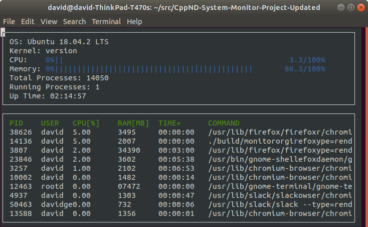

# CppND-System-Monitor

## Project Design

### System Data

Linux stores a lot of system data in files within the /proc directory. Most of the data that this project requires exists in those files.

### Operating System
Information about the operating system exists outside of the /proc directory, in the /etc/os-release file.

There are several strings from which to choose here, but the most obvious is the value specified by "PRETTY_NAME".

### Kernel
Information about the kernel exists in /proc/version file.

### Memory Utilization
Information about memory utilization exists in the /proc/meminfo file.

There are a variety of ways to use this data to calculate memory utilization.
Hisham H. Muhammad, the author of htop, wrote a [Stack Overflow answer] (https://stackoverflow.com/questions/41224738/how-to-calculate-system-memory-usage-from-proc-meminfo-like-htop/41251290#41251290) about how htop calculates memory utilization from the data in /proc/meminfo. This project calculates memory utilization based on this.

### Total Processes
Information about the total number of processes on the system exists in the /proc/meminfo file. 

### Running Processes
Information about the number of processes on the system that are currently running exists in the /proc/meminfo file.

### Up Time
Information about system up time exists in the /proc/uptime file.

This file contains two numbers (values in seconds): the uptime of the system (including time spent in suspend) and the amount of time spent in the idle process.

### Processor Data
Linux stores processor utilization data within the /proc/stat file.

This data is more complex than most of the other data necessary to complete this project.
For example, /proc/stat contains aggregate processor information (on the "cpu" line) and individual processor information (on the "cpu0", "cpu1", etc. lines). Indeed, [htop](https://hisham.hm/htop/) displays utilization information for each individual processor.

This project, however only display the aggregate CPU information, which you can find on the "cpu" line of /proc/stat.

### Data
/proc/stat contains 10 integer values for each processor. The Linux source code [documents each of these numbers](https://github.com/torvalds/linux/blob/master/Documentation/filesystems/proc.txt):
The very first "cpu" line aggregates the numbers in all of the other "cpuN" lines. These numbers identify the amount of time the CPU has spent performing different kinds of work. Time units are in USER_HZ (typically hundredths of a second). The meanings of the columns are as follows, from left to right:
•	user: normal processes executing in user mode
•	nice: niced processes executing in user mode
•	system: processes executing in kernel mode
•	idle: twiddling thumbs
•	iowait: In a word, iowait stands for waiting for I/O to complete. But there are several problems:
1.	Cpu will not wait for I/O to complete, iowait is the time that a task is waiting for I/O to complete. When cpu goes into idle state for outstanding task io, another task will be scheduled on this CPU.
2.	In a multi-core CPU, the task waiting for I/O to complete is not running on any CPU, so the iowait of each CPU is difficult to calculate.
3.	The value of iowait field in /proc/stat will decrease in certain conditions. So, the iowait is not reliable by reading from /proc/stat.
•	irq: servicing interrupts
•	softirq: servicing softirqs
•	steal: involuntary wait
•	guest: running a normal guest
•	guest_nice: running a niced guest
Even once you know what each of these numbers represents, it's still a challenge to determine exactly how to use these figures to calculate processor utilization. This [StackOverflow post](https://stackoverflow.com/questions/23367857/accurate-calculation-of-cpu-usage-given-in-percentage-in-linux) are helpful.

### Process Data
Linux stores data about individual processes in files within subdirectories of the /proc directory. Each subdirectory is named for that particular process's identifier number. The data that this project requires exists in those files.

### PID
The process identifier (PID) is accessible from the /proc directory. Typically, all of the subdirectories of /proc that have integral names correspond to processes. Each integral name corresponds to a process ID.

### User
Each process has an associated user identifier (UID), corresponding to the process owner. This means that determining the process owner requires two steps:
1.	Find the UID associated with the process
2.	Find the user corresponding to that UID
The UID for a process is stored in /proc/[PID]/status.

The [man page] (http://man7.org/linux/man-pages/man5/proc.5.html) for proc contains a "/proc/[pid]/status" section that describes this file.
For the purposes of this project, you simply need to capture the first integer on the "Uid:" line.

### Username
/etc/passwd contains the information necessary to match the UID to a username.

### Processor Utilization
Linux stores the CPU utilization of a process in the /proc/[PID]/stat file.

Much like the calculation of aggregate processor utilization, half the battle is extracting the relevant data from the file, and the other half of the battle is figuring out how to use those numbers to calculate processor utilization.
The "/proc/[pid]/stat" section of the proc [man page](http://man7.org/linux/man-pages/man5/proc.5.html) describes the meaning of the values in this file. This [StackOverflow answer](https://stackoverflow.com/questions/16726779/how-do-i-get-the-total-cpu-usage-of-an-application-from-proc-pid-stat/16736599#16736599) explains how to use this data to calculate the process's utilization.

### Memory Utilization
Linux stores memory utilization for the process in /proc/[pid]/status. Check for the key 'VmSize'.
In order to facilitate display, convert the memory utilization into megabytes

### Up Time
Linux stores the process up time in /proc/[pid]/stat.

The "/proc/[pid]/stat" section of the proc [man page](http://man7.org/linux/man-pages/man5/proc.5.html) describes each of the values in this file.
(22) starttime %llu
The time the process started after system boot. In kernels before Linux 2.6, this value was expressed in jiffies. Since Linux 2.6, the value is expressed in clock ticks (divide by sysconf(_SC_CLK_TCK)).
Note that the "starttime" value in this file is measured in "clock ticks". In order to convert from "clock ticks" to seconds, you must:
•	#include [<unistd.h>](https://pubs.opengroup.org/onlinepubs/9699919799/basedefs/unistd.h.html)
•	divide the "clock ticks" value by sysconf(_SC_CLK_TCK)
Once you have converted the time value to seconds, you can use the Format::Time() function from the project starter code to display the seconds in a "HH:MM:SS" format.

### Command
Linux stores the command used to launch the function in the /proc/[pid]/cmdline file.

## ncurses
[ncurses](https://www.gnu.org/software/ncurses/) is a library that facilitates text-based graphical output in the terminal. This project relies on ncurses for display output.

Install ncurses within your own Linux environment: `sudo apt install libncurses5-dev libncursesw5-dev`

## Make
This project uses [Make](https://www.gnu.org/software/make/). The Makefile has four targets:
* `build` compiles the source code and generates an executable
* `format` applies [ClangFormat](https://clang.llvm.org/docs/ClangFormat.html) to style the source code
* `debug` compiles the source code and generates an executable, including debugging symbols
* `clean` deletes the `build/` directory, including all of the build artifacts

## Instructions

1. Clone the project repository: `git clone https://github.com/rakeshch/CppND-System-Monitor.git`

2. Build the project: `make build`

3. Run the resulting executable: `./build/monitor`

